# Rhine Lab · 莱茵生命交互桌面

> **本地修改版来源说明：** 本版本基于 [LBEILC](https://github.com/LBEILC) 的 [RhineLabWallpaper](https://github.com/LBEILC/RhineLabWallpaper) 修改，原网页项目为 [RhineLabUI](https://github.com/LBEILC/RhineLabUI)。保留原作者 MIT 版权与许可声明。详见 [来源与修改版说明](public/ATTRIBUTION.md)。下文原项目的在线体验、创意工坊和下载链接均指向原作者发布的版本。

**Wallpaper Engine 交互壁纸的独立源码仓库。**

支持中英文：在 WE 壁纸属性顶部选择「语言 / Language」。壁纸内设置已移除，所有长期配置统一在 WE 属性调整；右下角保留重播。原英文开场与图形文字不变。[中英文使用与维护说明](docs/LOCALIZATION.md)

**English:** Choose **Language / 语言 → English** in this wallpaper’s Wallpaper Engine properties. Configure the wallpaper there; it no longer has an internal settings dialog. Includes English workspace tools, hints and all 40 archives. [English instructions](docs/LOCALIZATION.md#english)

[创意工坊订阅](https://steamcommunity.com/sharedfiles/filedetails/?id=3799142774) · [GitHub 构建包](docs/GITHUB-RELEASE.md) · [壁纸开发说明](docs/WALLPAPER-ENGINE.md) · [原网页项目](https://github.com/LBEILC/RhineLabUI)

本项目从 RhineLabUI 的 `codex/wallpaper-engine` 分支迁移，保留完整提交历史。壁纸后续开发在本仓库的 `main` 分支进行；下方在线体验为原项目的网页版本。

**把莱茵生命的终端，做成可以操作的三维界面。**

**[在线体验 → rhine.lubeiluchen.cc](https://rhine.lubeiluchen.cc/)**

iPhone 可用 Safari 打开在线版，通过“分享 → 添加到主屏幕”安装；从主屏幕图标进入可使用独立窗口。首次联网后，设置中显示“离线资源已就绪”即可离线浏览档案和模型。支持桌面不同比例、手机横竖屏和触摸操作。[安装与更新说明](docs/PWA.md)

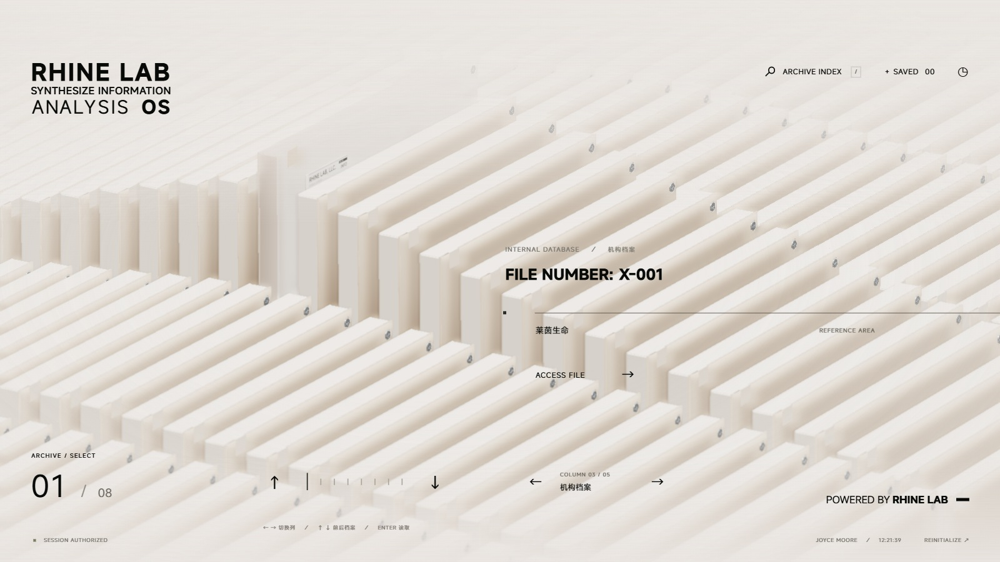

这是对《明日方舟》特别映像「莱茵生命：访问」终端界面的非官方复刻。从白底开场进入五列循环档案阵列，抽取一份档案，等待玻璃与正文解密，再进入独立查看器观察内部结构。

项目以原 PV 的 **5–40 秒**为主要视觉与动效参考，实际开场从 **6.76 秒的白色画面**开始；内部结构另参考约 **41 秒及 46–51 秒**的正面与多角度画面。检索、收藏、正文阅读、结构拆解与声音设置是可操作的扩展功能。

代码由 GPT-6 Astra 协助完成，模型通过 Blender MCP 制作。界面采用 **TypeScript + Three.js + Vite**，运行时实时渲染三维模型，开场由 DOM / SVG 与场景时间轴驱动。

[快速运行](#快速运行) · [界面与动效](#界面与动效) · [操作说明](#操作说明) · [源码与 Blender 工程下载](https://pan.quark.cn/s/463285897234) · [参考原 PV](https://www.bilibili.com/video/BV1rr4y1b7sz/)

## Wallpaper Engine 交互桌面

本仓库使用 **`main`** 维护 Wallpaper Engine 交互桌面。网页正式版继续在 [RhineLabUI](https://github.com/LBEILC/RhineLabUI) 维护；[原壁纸分支](https://github.com/LBEILC/RhineLabUI/tree/codex/wallpaper-engine) 保留迁移记录。

**[在 Steam 创意工坊订阅壁纸 → Rhine Lab · 莱茵生命交互桌面](https://steamcommunity.com/sharedfiles/filedetails/?id=3799142774)**

如果创意工坊条目暂时无法订阅（Steam 反垃圾内容检查期间，条目页会显示“此物品与 Wallpaper Engine：壁纸引擎 不兼容”），可以从 GitHub 下载构建包并在本地加载，功能与工坊版一致：

**[下载最新构建 → GitHub Releases](https://github.com/LBEILC/RhineLabWallpaper/releases/latest)** · [本地安装说明](docs/GITHUB-RELEASE.md)

每次推送到 `main` 都会自动重新构建并刷新该发布页，产出 `RhineLabWallpaper-latest.zip` 与 `.sha256` 校验文件。解压得到的 `RhineLabWallpaper` 文件夹放入 Wallpaper Engine 的 `projects\myprojects\`，在“已安装”里选择并应用即可；创意工坊更新仍保留原 workshopid。

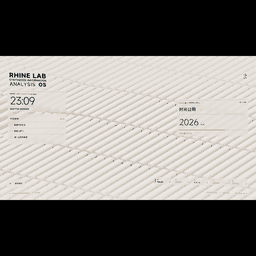

- **两种工作模式**：三维档案展示与桌面工作台，可显示时间日期、今日事项、日程倒计时、系统媒体信息和专注计时。
- **壁纸交互**：音乐律动、呼吸效果、波纹接力小游戏，以及亮暗配色、玻璃模糊、HUD 曲面与视差。
- **登录身份与自动明暗**：在 WE 属性中修改登录人姓名（开场身份确认、页脚与访问记录同步），并可设置切换为深色与浅色的时间，按本机时间自动切换。
- **按需保留画面**：在 WE 属性中选择显示哪些组件；可关闭启动时加载 3D，播放 2D 开场后直接进入工作台，再从左下角手动载入模型。
- **自定义图片**：关闭 3D 后可显示自行选择的壁纸，支持调整上下遮罩范围，设为 0 即关闭；时钟和媒体信息复用滚动数字与文字效果。
- **宿主适配**：接入 WE 属性、音频响应、媒体信息、帧率及暂停通知，壁纸资源本地打包，壁纸构建不启用 PWA。

使用壁纸请优先通过上方创意工坊链接订阅；条目暂时不可订阅时，使用 GitHub Releases 的构建包。需要自己构建时：

```sh
git clone https://github.com/LBEILC/RhineLabWallpaper.git
cd RhineLabWallpaper
npm ci
npm run build:wallpaper
```

输出目录为 `release/wallpaper`，在 Wallpaper Engine 编辑器中打开其中的 `index.html`。`npm run release:wallpaper` 会额外打包出可直接解压的 zip 并校验内容。系统媒体信息取决于播放器支持及 WE 媒体集成设置。更多细节见 [壁纸使用与开发说明](docs/WALLPAPER-ENGINE.md)、[GitHub 构建包与本地加载](docs/GITHUB-RELEASE.md) 和 [创意工坊发布说明](docs/WORKSHOP-PUBLISH.md)。

以下为项目共用的网页与三维档案功能介绍。


## 新版效果

- **模型与正文同步解密**：对角解密线合拢、保持并收束，盖板自上而下由磨砂变清晰；右侧文档的遮挡条随之退开，露出标题、资料字段与正文。
- **可看清的双环内构**：双环、连接带与白色／橙色部件封装在盖板与基板之间。顶边黄色方块、两处螺丝和盖板后的刻线补全了外壳细节。
- **清晰／磨砂切换**：独立查看器可以随时改变玻璃状态，保留当前视角和拆解位置；支持平滑缩放、平移及复位。
- **滚动文字与编号**：档案标题、分类、权限标签及编号连续滚动，快速输入衔接最新选择。
- **重新校准的开场**：逐字输入、圆环绕行、连续 Logo 笔画、身份验证和欢迎转场，按原片逐帧修订轨迹与节奏。
- **声音与画质设置**：玻璃交互音、系统电子音与三轨循环配乐；音效和音乐可独立开关、调节音量。画质提供四档预设及精细设置。

## 界面与动效

以下截图与动图于 **2026-09-09** 重新采集，均来自当前版本的实际浏览器运行。截图为 **1600 × 900**，GIF 为 **8–12 fps**、原速播放；压缩后的帧率与颜色不代表实时渲染质量。采集版本与复现步骤见 [素材说明](docs/media/README.md)。

### 抽取、解密与阅读

档案竖直升起，镜头靠近并转向详情构图。解密时玻璃与文档一起揭示；完成后可阅读概述、研究记录及访问日志，也可以收藏或导出 UTF-8 文本。

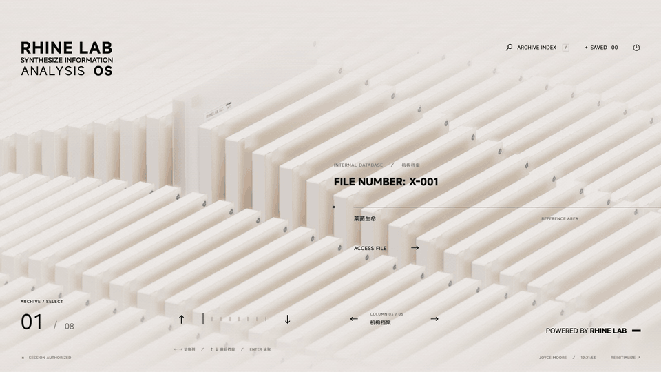

| 解密完成 · 清晰内构与档案概述 | 研究记录 · 正文阅读 |
| --- | --- |
| [](docs/media/detail.jpg) | [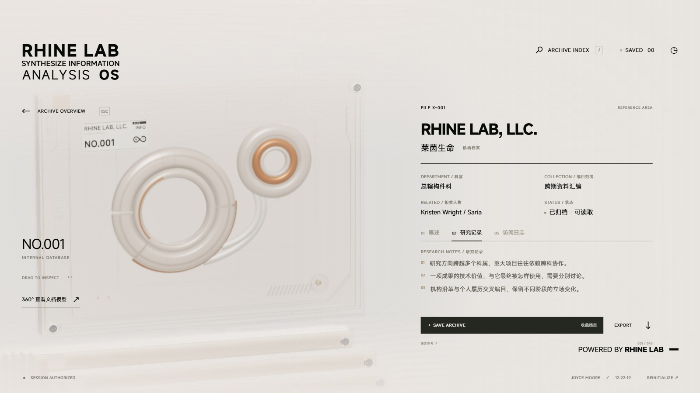](docs/media/research.jpg) |

### 清晰内构与磨砂玻璃

在 360° 查看器中比较两种玻璃状态。切换不会重置镜头或拆解状态，返回详情后仍保留已解密状态。

| 清晰 · 双环与连接带 | 磨砂 · 轻柔折射 |
| --- | --- |
| [](docs/media/viewer-clear.jpg) | [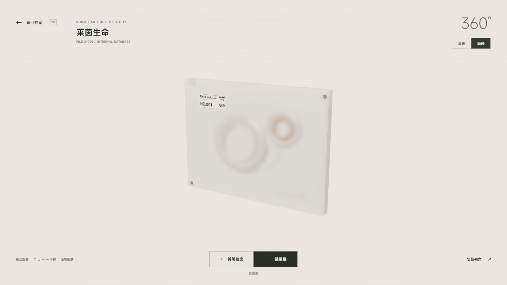](docs/media/viewer-frosted.jpg) |

<details>
<summary><strong>查看动图：清晰／磨砂连续切换</strong></summary>

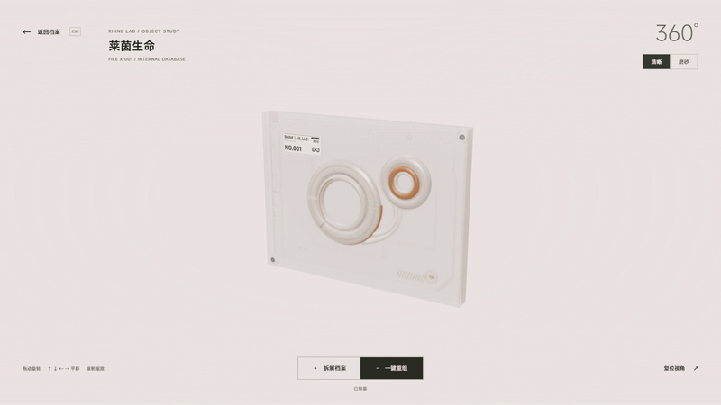

</details>

### 360° 旋转、拆解与重组

紧固件、透明盖板、折射环组、光学核心、信息基板、背板与框架按六组展开。拆解后仍可旋转、平移和缩放，观察部件之间的关系，再一键重组。

[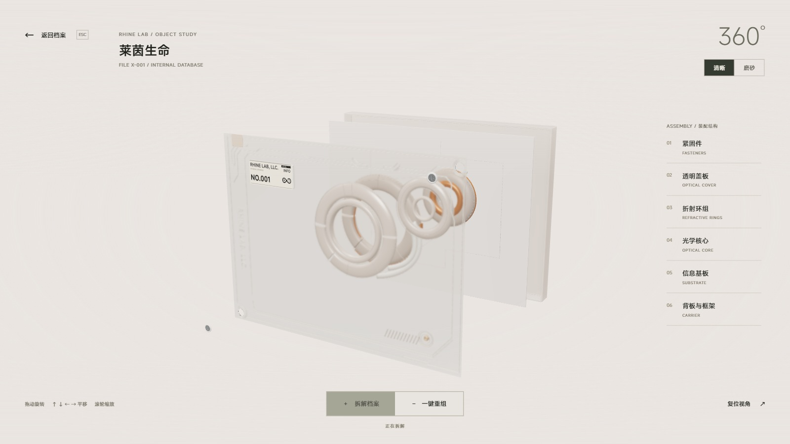](docs/media/assembly.jpg)

<details>
<summary><strong>查看动图：模型拆解、旋转与重组</strong></summary>

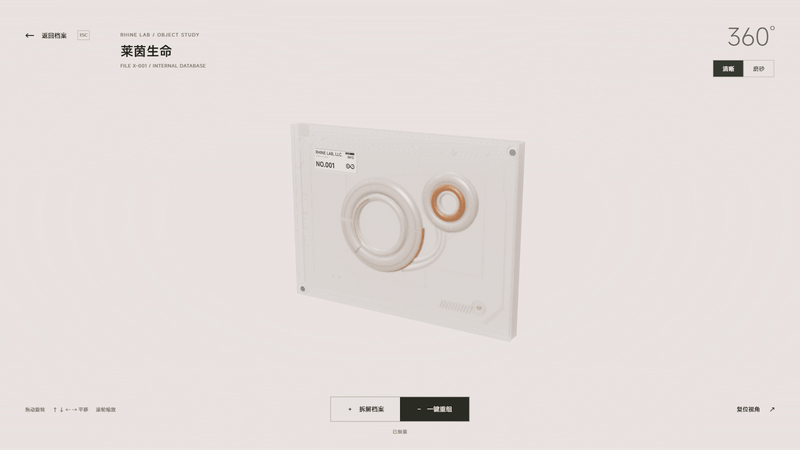

</details>

### 循环阵列与滚动标题

五类、每类八份，共 **40 份档案**。上下翻阅、左右切列均可持续循环；切回某列时保留上次选择。选中抬起与阵列波浪同时开始，标题和编号跟随输入滚动；返回阵列时，档案先转正再下降。

<details>
<summary><strong>查看动图：切列、翻阅与连续文字滚动</strong></summary>

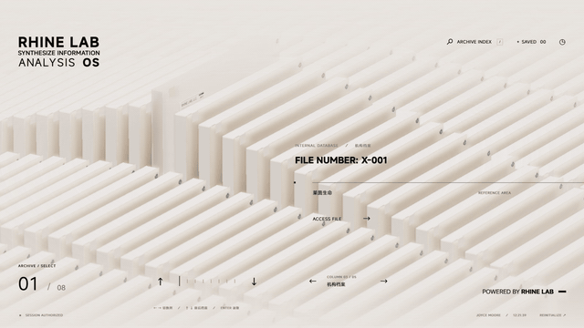

</details>

### 白底开场

从终端逐字输入到圆环、Logo 绘制，再进入身份接入与权限验证。可以重播，也可以跳过开场直接进入阵列。

[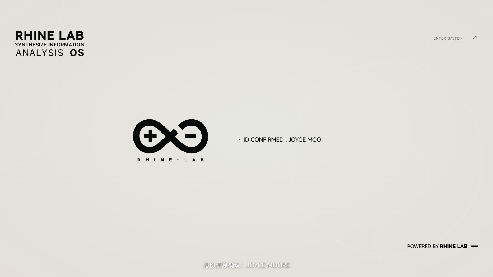](docs/media/boot.jpg)

<details>
<summary><strong>查看动图：新版开场片段</strong></summary>

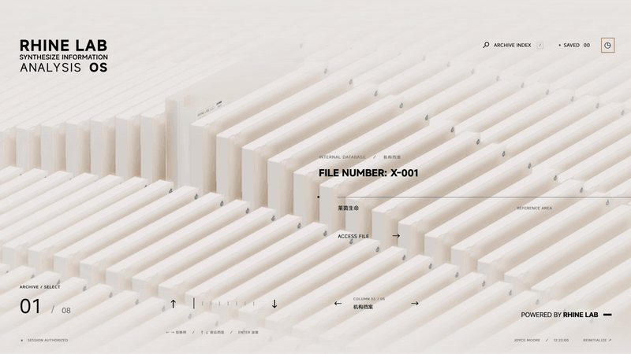

</details>

### 检索、声音与画质

检索支持编号、标题、英文名、科室、相关人物与分类筛选。收藏和设置保存在当前浏览器中。音效区分档案的玻璃碰触与系统操作的电子反馈，背景配乐随开场、阵列、详情和查看器调整三轨比例。

| 档案索引 · 关键词与分类筛选 | 系统设置 · 声音与画质 |
| --- | --- |
| [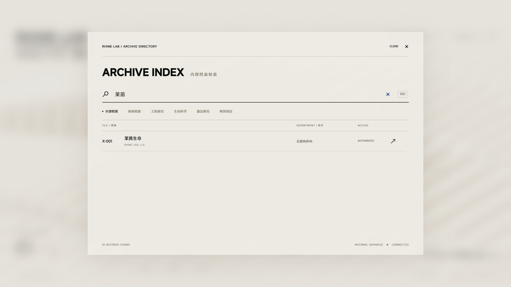](docs/media/search.jpg) | [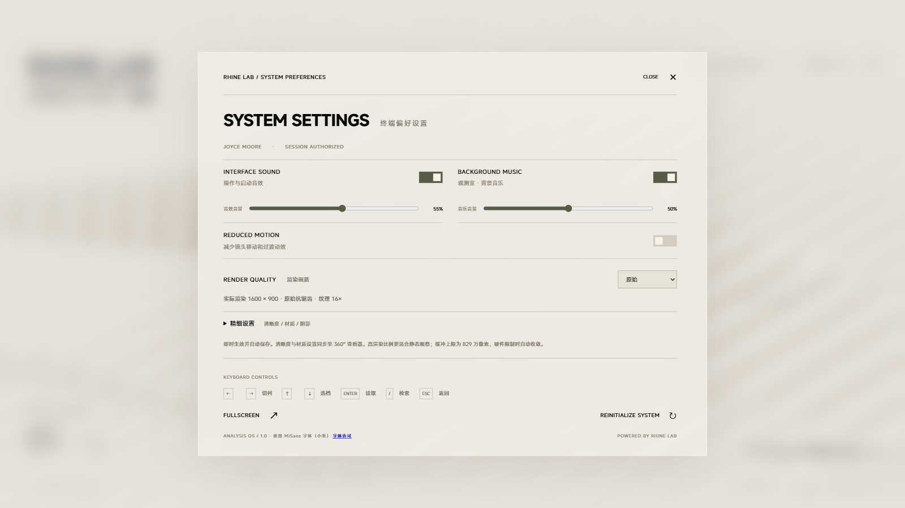](docs/media/settings.jpg) |

GIF 不含声音。可单独[试听原创配乐「观测室」](public/audio/observatory-preview.mp3)，完整声音效果请启动应用体验。浏览器可能需要一次点击或按键才允许播放音频。

## 快速运行

需要 **Node.js 22.12 或更高版本**（可使用 Node.js 24），以及支持 WebGL 2 的现代桌面浏览器。首次安装依赖需要网络；应用不需要 API Key，也不需要启动后端服务。

### 获取项目

```sh
git clone https://github.com/LBEILC/RhineLabWallpaper.git
cd RhineLabWallpaper
```

也可以从 GitHub 的 **Code → Download ZIP** 下载当前源码，或获取[夸克项目包](https://pan.quark.cn/s/463285897234)。夸克包是 **2026-09-09 的打包快照**，包含源码、运行模型与 Blender 源工程；后续更新以本仓库为准。

### 安装并启动

```sh
npm ci
npm run dev
```

打开终端显示的地址，通常为 `http://127.0.0.1:5173/`。如果端口被占用，以终端实际输出为准。

Windows 用户安装 Node.js 并解压项目后，也可以双击 [`启动终端.cmd`](启动终端.cmd)：首次运行会安装依赖，然后启动本地服务并打开浏览器。

### 构建与预览

```sh
npm run build
npm run preview
```

生产文件输出到 `dist/`，可以交给静态 HTTP 服务托管。请通过服务地址访问，不要直接双击 `dist/index.html`。

## 操作说明

### 终端与档案

| 操作 | 效果 |
| --- | --- |
| 开场中按 `Enter` / `Esc`，或点击 `ENTER SYSTEM` | 资源就绪后进入交互阵列 |
| `←` / `→` | 切换档案类别，首尾循环 |
| `↑` / `↓` | 翻阅同类档案，首尾循环 |
| `Enter`、`ACCESS FILE` 或文件编号 | 读取当前档案 |
| 在详情模型上拖动 | 档案获得净空后，旋转观察 |
| `/` 或 `ARCHIVE INDEX` | 打开检索，可搜索编号、标题、英文名、科室、负责人和分类 |
| `SAVE ARCHIVE` / `SAVED` | 收藏当前档案 / 查看收藏 |
| `EXPORT` | 下载当前档案的文本文件 |
| `Esc` | 关闭当前弹窗，或从详情返回阵列 |

### 独立模型查看器

在详情页点击 **「360° 查看文档模型」** 进入。

| 操作 | 效果 |
| --- | --- |
| 鼠标拖动 | 环绕旋转模型 |
| 滚轮、`+` / `−` | 平滑缩放 |
| 方向键 | 平移观察位置 |
| 「复位视角」或 `Home` | 平滑恢复初始观察位置 |
| 「清晰」 / 「磨砂」 | 切换玻璃状态，保留视角和拆解位置 |
| 「拆解档案」 / 「一键重组」 | 展开六组部件 / 连续收回 |
| `Esc` 或「返回档案」 | 关闭查看器，返回原档案 |

### 显示与偏好

布局以 **1920 × 1080** 为基准等比例适应窗口，主要面向桌面与横向屏幕。设置页提供音效与背景音乐的独立开关、独立音量，以及减少动态效果、画质、全屏和重新播放开场。收藏和偏好保存在当前浏览器中。

首次载入需要加载字体与 GLB 模型。项目保留了四份官方 MiSans WOFF2，合计约 19.7 MB，按实际使用加载。画质预设为**性能、原始、高、极高**，默认使用原始；精细设置可调整渲染比例、像素密度、抗锯齿、纹理过滤、透明材质分辨率、阴影、环境遮蔽及景深。运行不够流畅时可选性能档；需要简化镜头、文字与揭示动画时，可启用减少动态效果。

## 工程结构

| 目录或文件 | 内容 |
| --- | --- |
| [`src/main.ts`](src/main.ts) | 页面状态、档案阅读、检索、收藏与快捷键 |
| [`src/boot.ts`](src/boot.ts)、[`src/boot-motion.ts`](src/boot-motion.ts) | 开场界面与逐帧时间轴 |
| [`src/scene.ts`](src/scene.ts)、[`src/archive-loop.ts`](src/archive-loop.ts) | Three.js 场景、循环阵列、抽取与归位 |
| [`src/model-viewer.ts`](src/model-viewer.ts) | 独立模型查看器与拆解动画 |
| [`src/decryption.ts`](src/decryption.ts)、[`src/document-decryption.ts`](src/document-decryption.ts) | 模型解密轨迹与正文同步揭示 |
| [`src/audio.ts`](src/audio.ts)、[`public/audio/`](public/audio/) | 交互音效、三轨配乐与音源记录 |
| [`src/render-quality.ts`](src/render-quality.ts)、[`src/quality-renderer.ts`](src/quality-renderer.ts) | 画质预设与渲染管线 |
| [`content/archives.json`](content/archives.json) | 页面与下载共用的五类、40 份档案数据 |
| [`src/data.ts`](src/data.ts) | 档案类型与阵列位置映射 |
| [`public/assets/`](public/assets/) | 运行所需的 GLB 模型 |
| [`public/archives/`](public/archives/) | 导出的档案文本；启动和构建前自动生成 |
| [`art/`](art/) | Blender 源文件、建模与审阅脚本 |
| [`scripts/`](scripts/) | 档案导出与行为检查 |
| [`reference/`](reference/)、[`verification/`](verification/) | 开发对照工具与分阶段验证记录 |
| [`docs/media/`](docs/media/) | README 截图与动图 |
| [`DESIGN.md`](DESIGN.md) | 视觉、相机、材质与运动约束 |

原片时间轴使用 160 个阵列位置；交互模式使用固定的可见窗口与外围卡片补位，让有限的档案内容可以持续循环。

### 修改与复核

修改档案内容从 [`content/archives.json`](content/archives.json) 入手，字段与操作步骤见 [档案修改说明](content/README.md)。`npm run dev` 与 `npm run build` 会先校验数据，再更新 `public/archives/` 中的文本导出；开发过程中修改数据后，可执行 `npm run export:archives` 同步下载文件。`npm run check:content` 检查数据规则与导出一致性。

```sh
node scripts/check-motion.mjs
node scripts/check-loop.mjs
node scripts/check-appearance.mjs
node scripts/check-assembly.mjs
node scripts/check-decryption.mjs
node scripts/check-shell.mjs
node scripts/check-internal-optics.mjs
node scripts/check-quality.mjs
node scripts/check-identity-theme.mjs
```

这些脚本检查运动、循环位置、外观、装配结构、解密轨迹、外壳、内构、画质参数与登录身份／自动明暗调度。`node scripts/check-identity-theme-host.mjs` 额外用本机 Wallpaper Engine 窗口验证这两项 WE 属性。视觉效果仍需在浏览器中实际查看，尤其是快速切换、模型归位、文档揭示及查看器进出过渡。

| 本地调试路径 | 用途 |
| --- | --- |
| `/?scene=archive` | 直接进入档案阵列 |
| `/?scene=detail` | 直接进入档案详情 |
| `/?time=28&freeze=1` | 固定在参考时间轴的指定时刻 |
| `/reference/review.html`、`/reference/boot-review.html` | 原片与复刻对照工具 |
| `/reference/decryption-review.html` | 玻璃解密逐帧对照 |
| `/reference/document-decryption-check.html` | 正文同步解密与布局检查 |
| `/reference/boot-audio.html` | 完整开场声音试听 |

原 PV 不随仓库分发。使用视频对照工具时，需要自行准备对应参考视频；正常运行应用不依赖它。

### Blender 源工程

| 文件 | 用途 |
| --- | --- |
| [`art/rhine-archive.blend`](art/rhine-archive.blend) | 档案盒基础模型与审阅灯光 |
| [`art/archive-assembly.blend`](art/archive-assembly.blend) | 可按六组结构拆解的模型 |
| [`art/build_archive.py`](art/build_archive.py) | 生成基础模型与 GLB |
| [`art/build_assembly.py`](art/build_assembly.py) | 生成拆解模型与 GLB |
| [`art/internal_architecture.py`](art/internal_architecture.py) | 当前双环内构与连接带 |
| [`art/shell_reference_details.py`](art/shell_reference_details.py) | 顶边方块、螺丝及盖板后刻线 |
| [`art/setup_studio.py`](art/setup_studio.py) | 配置资产审阅灯光与相机 |

普通运行直接使用现有 GLB 即可，无需安装 Blender。重新建模时，可在 Blender 的脚本环境中通过 `runpy.run_path()` 执行对应脚本，或通过 Blender MCP 调用。脚本根据自身位置确定项目目录，重新生成会更新对应模型输出。

## 参考与资源说明

参考作品为《明日方舟》特别映像「莱茵生命：访问」：[BV1rr4y1b7sz](https://www.bilibili.com/video/BV1rr4y1b7sz/)。本项目与官方制作方无隶属关系，原 PV、相关名称、标志与设定的权利归各自权利人所有。原片未展示的档案摘要、日期、研究记录等属于本项目的扩展演示内容。

模型为重新制作；实时折射、景深、灯光与局部细节和原 PV 仍有差异。身份验证画面是演示状态机，不连接真实身份或业务服务。

- **MiSans**：使用小米官方字体文件，保留[字体许可](public/fonts/MiSans-license.pdf)及字体目录内的版权说明，设置页也提供署名与许可入口。
- **Rolling Number**：用于编号和文字滚动，许可见 [`public/licenses/rolling-number.txt`](public/licenses/rolling-number.txt)。
- **声音**：三轨配乐为本项目程序编配；逐字输入使用原 PV 的三个 38ms 短音，来源与处理记录见 [音频说明](public/audio/README.md)。原片短音及其衍生片段不纳入原创配乐的 MIT 授权声明。
- **其他依赖**：各自遵循其原有许可。源码公开不改变第三方资源的权利。

源码包包含运行代码、模型、Blender 工程、说明与验证脚本，不包含依赖目录、本机缓存、原 PV 或完整录制素材。

## 开源许可

本项目自行编写且有权授权的程序代码、建模脚本及配套技术文档采用 [MIT License](LICENSE)，版权署名为 **Copyright (c) 2026 LBEILC**。你可以使用、修改、分发这些内容，也可以将其用于商业或闭源项目；分发代码或其重要部分时，须保留版权声明和许可证。软件按原样提供，不作担保，具体以许可证全文为准。

MIT 授权不覆盖第三方权利或自动覆盖仓库内全部素材：

- 《明日方舟》及莱茵生命相关名称、标志、设定、原 PV 和原作视觉设计，以及它们在模型、界面、截图或演示文本中的呈现，不因本项目公开而获得额外授权。本项目无法代替相应权利人授予这些权利。
- Blender / GLB 模型、图像、动图等非代码资产未另行声明为 MIT；建模脚本采用 MIT 不表示脚本生成的原作相关视觉内容也已获授权。
- MiSans、Rolling Number 及其他第三方依赖继续遵循各自的许可证和版权声明，见上方「参考与资源说明」。

复用代码时，请根据用途处理涉及的第三方素材与标志。GitHub 当前源码包已包含本许可证；上方夸克链接为早期打包快照，未包含本次新增的项目许可证文件，最新许可说明以本仓库为准。
